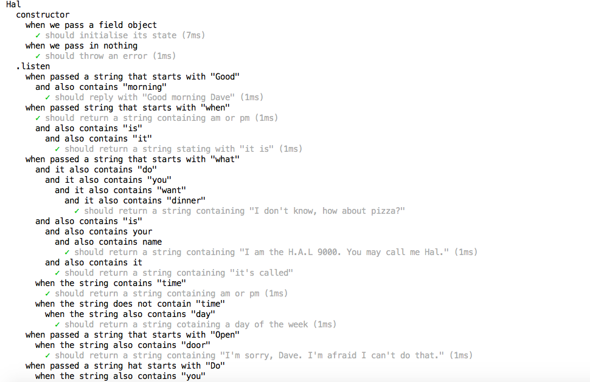

# TDD Roho project

## Summary
The goal of the project was to learn about Test-driven development(TDD) and Behavior-driven development(BDD). We practied writing BDD stories to plan out what features we would build and how. We used Interface Discovery to think of how our library would be used by others as scaffolding.

## Languages and tools used:
* Javascript
* Jest
